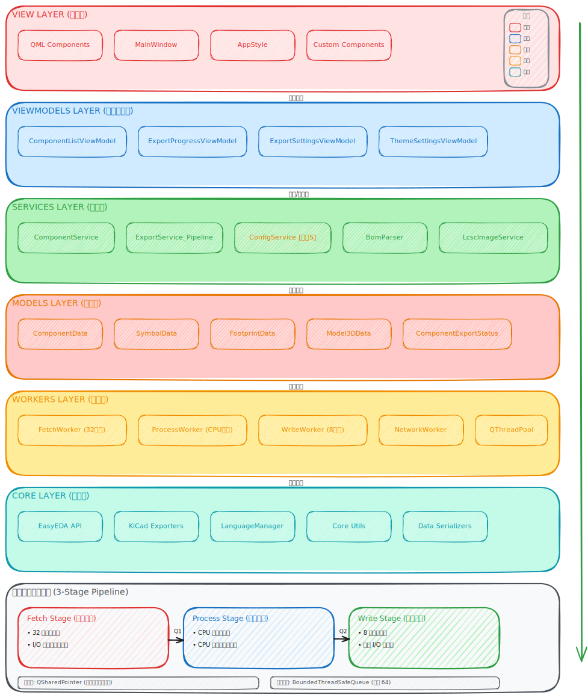
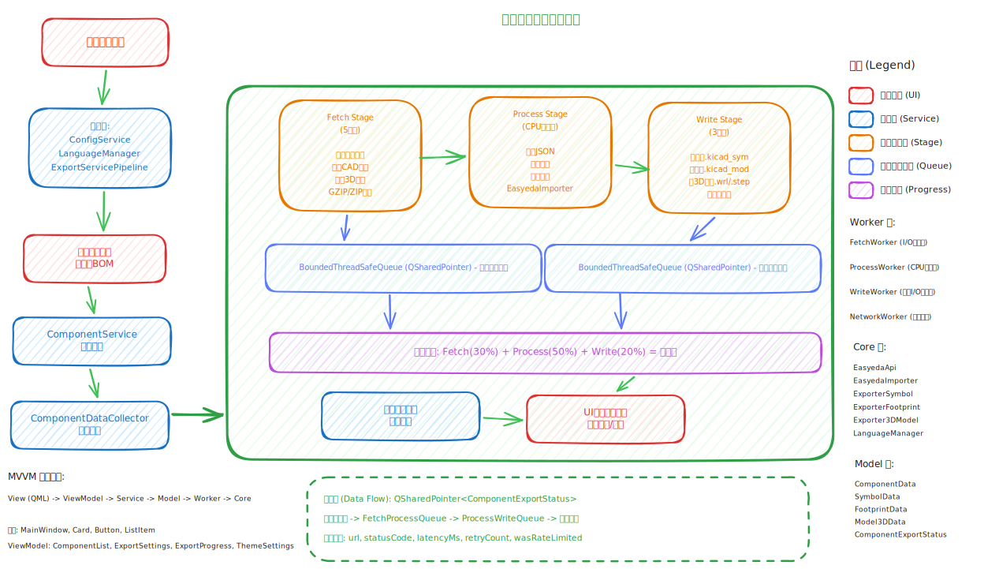

<h1 align="center">EasyKiConverter</h1>

  <a href="README_en.md">English</a> | <a href="README.md">中文</a>

    
     
    
    
    
    
    
    
    
    

**EasyKiConverter** is a modern C++ desktop tool based on Qt 6 and MVVM architecture, designed for electronics engineers to efficiently convert component data from LCSC and EasyEDA into KiCad library files.

## Key Features

*   **Complete Conversion**: Full export support for Symbols (.kicad_sym), Footprints (.kicad_mod) and 3D Models (STEP/WRL).
*   **Multi-unit Symbols**: Support for multi-unit symbol conversion.
*   **Efficient Batch Processing**: Multi-threaded parallel conversion and BOM file import support, fully utilizing multi-core performance.
*   **Modern Experience**: Fluid UI based on Qt Quick, supporting dark/light theme switching.
*   **Smart Configuration**: Real-time auto-save of settings, supporting breakpoint memory and debug mode state restoration.
*   **Smart Assistance**: Support for intelligent extraction of component IDs from clipboard.
*   **LCSC Preview Images**: Automatically fetch LCSC component preview images, supporting thumbnail display and hover preview.

## Quick Start

### Installation
Please visit the [Releases](https://github.com/tangsangsimida/EasyKiConverter_QT/releases) page to download the version for your platform:

*   **Windows**: Recommended to download `.exe` installer (includes complete runtime), or download `.zip` portable version.
*   **Linux**: Recommended to download `.AppImage` (no installation required, just grant execute permission and run), or `.tar.gz` archive.
*   **macOS**: Download `.dmg` image file.

### Build from Source
This project has implemented full-platform CI/CD automated building. If you are a developer or wish to compile yourself, please refer to the [Build Guide](docs/developer/BUILD.md).

## System Architecture

EasyKiConverter adopts a modern MVVM architecture design, achieving a clear layered structure and efficient parallel processing.

## Documentation

**User Guide**
*   [Getting Started](docs/user/GETTING_STARTED.md) | [User Manual](docs/user/USER_GUIDE.md) | [FAQ](docs/user/FAQ.md)
*   [Detailed Features](docs/user/FEATURES.md)

**Developer Resources**

*   [Contributing Guide](docs/developer/CONTRIBUTING.md) | [Architecture](docs/developer/ARCHITECTURE.md) | [Build Guide](docs/developer/BUILD.md)

## Contribution & Acknowledgment

### Contributors

We thank the following developers for their contributions to EasyKiConverter:

Issues and Pull Requests are welcome! Please see the [Contributing Guide](docs/developer/CONTRIBUTING.md) for details.

## License

This project is licensed under **GPL-3.0**. See the [LICENSE](LICENSE) file for details.
