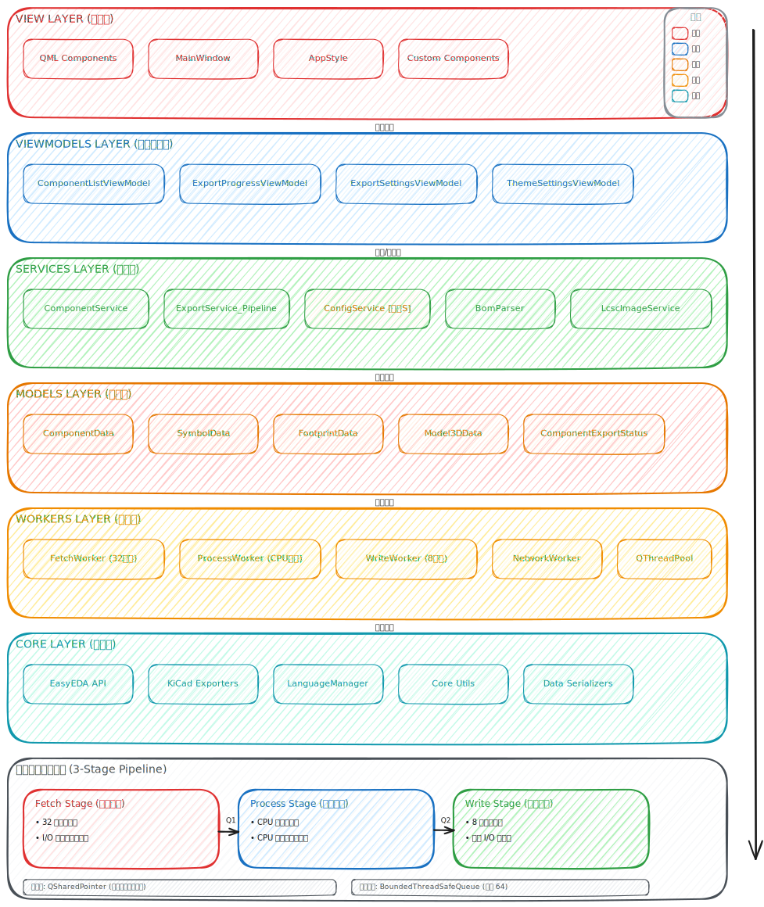

# API 参考

本节包含 EasyKiConverter 的自动生成 API 参考文档，由 [Doxygen](https://www.doxygen.nl/) 从源代码注释生成。

## 访问 API 文档

- **[C++ API 参考](html/index.html)** - 完整的类、函数、信号槽参考

## 文档覆盖范围

API 文档包含以下模块：

| 模块 | 描述 | 主要类 |
|------|------|--------|
| **Core** | 核心功能（EasyEDA API、KiCad 导出器） | `EasyedaApi`, `SymbolExporter`, `FootprintExporter` |
| **Services** | 业务逻辑服务 | `ComponentService`, `ExportService`, `ConfigService` |
| **ViewModels** | MVVM 架构视图模型 | `ComponentListViewModel`, `ExportSettingsViewModel` |
| **Models** | 数据模型 | `ComponentData`, `SymbolData`, `FootprintData` |
| **Workers** | 后台工作线程 | `FetchWorker`, `ProcessWorker`, `WriteWorker` |
| **Utils** | 工具类 | `Logger`, `BoundedThreadSafeQueue` |

## 架构图

详细架构请参考 [架构设计文档](../developer/ARCHITECTURE.md)。



## 如何阅读 API 文档

### 类文档结构

每个类的文档包含：

1. **类概述** - 类的用途和职责
2. **继承关系** - 父类和子类
3. **公有成员** - 可用的方法和属性
4. **信号** - Qt 信号（用于事件通知）
5. **槽** - Qt 槽函数（用于响应信号）
6. **受保护成员** - 子类可访问的成员

### 信号槽说明

由于项目使用 Qt 框架，API 文档中会标注：

- `Q_SIGNALS` / `signals:` - 信号声明
- `Q_SLOTS` / `slots:` - 槽函数声明
- `Q_INVOKABLE` - QML 可调用方法

### 线程安全性

文档会标注方法的线程安全性：

- **线程安全** - 可从任意线程调用
- **仅主线程** - 必须从 GUI 线程调用
- **异步安全** - 可跨线程使用信号槽

## 生成 API 文档

### 前提条件

安装 Doxygen 和 Graphviz：

```bash
# Windows (Chocolatey)
choco install doxygen graphviz

# macOS
brew install doxygen graphviz

# Linux (Ubuntu/Debian)
sudo apt install doxygen graphviz
```

### 生成命令

```bash
# 在项目根目录执行
doxygen Doxyfile
```

输出将生成到 `docs/api/html/` 目录。

### 文档注释规范

请遵循 [代码风格指南](../developer/CODING_STYLE.md) 中的注释规范：

```cpp
/**
 * @brief 获取组件数据
 * 
 * 从 LCSC 服务器获取指定 ID 的组件信息。
 * 
 * @param lcscId LCSC 元件编号（如 "C12345"）
 * @param callback 回调函数，接收获取结果
 * 
 * @note 此方法为异步操作，结果通过回调返回
 * @see fetchComponentDataSync()
 */
void fetchComponentData(const QString& lcscId, Callback callback);
```

## 更新 API 文档

API 文档应与代码同步更新：

1. 修改代码时添加/更新文档注释
2. 提交前运行 `doxygen Doxyfile` 检查警告
3. CI 流程会自动生成并部署最新文档

---

*API 文档版本: {{ config.extra.version }}*
