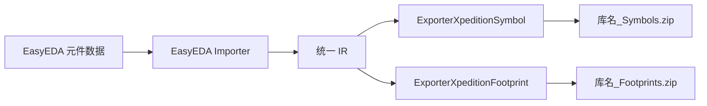

# Xpedition ASCII 库导出能力

本文说明 EasyKiConverter 当前基于统一 IR 的 Xpedition ASCII 库导出能力。该能力只负责 EasyEDA 数据经 IR 生成目标文本，不负责读取 Xpedition 库，也不承诺未经目标版本软件验证的完整兼容性。

## 当前状态

| 能力 | 状态 | 说明 |
| --- | --- | --- |
| 符号导出 | 已实现 | 输出 Xpedition ASCII 符号文本，支持引脚、电气类型、主体边界、矩形、折线、多边形、圆和三点圆弧 |
| 封装导出 | 已实现 | 输出 Padstack 和 Cell HKP 文本，包含外形、焊膏/阻焊焊盘、圆孔、槽孔、图形、文本、区域和独立孔 |
| 封装几何保真 | 已实现 | 支持旋转矩形、圆弧折线近似，以及 TopOverlay/BottomOverlay 到对应丝印面的映射 |
| 多部件符号 | 已实现 | 每个部件写入独立的符号条目 |
| ZIP 打包 | 已实现 | 符号库和封装库分别生成独立的不压缩 ZIP 包 |
| 3D 模型关联 | 未实现 | 当前不会写入 Xpedition 3D 模型关联；CLI 和 GUI 会明确提示并跳过该选项 |
| 目标软件实机验证 | 未完成 | 自动化测试只验证文本结构、ZIP 完整性和项目内导出流程 |

## 数据流

Exporter 不重新解析 EasyEDA JSON。坐标、引脚语义、焊盘类型和封装图元均先由 IR Builder 归一化，再由 Xpedition 导出器完成单位和语法转换。

## 单位和坐标

- IR 几何单位为 mm。
- Xpedition 文本当前使用 thousandth inch（TH）单位。
- 长度换算为 `mm / 0.0254`。
- 封装 Cell 的原点取当前几何边界框中心，输出时翻转 Y 坐标。
- 通孔焊盘的圆孔和槽孔会分别生成 Hole 定义；槽孔使用孔径和槽长生成独立的宽高记录。
- 符号坐标保留 IR 的方向约定，并转换为目标文本使用的 TH 数值。

## 输出文件

一次同时导出符号和封装时会生成：

- `<lib-name>_Symbols.zip`：文件名为 `<symbol-name>.<part-number>` 的 ASCII 符号条目。
- `<lib-name>_Footprints.zip`：每个封装包含 `<name>_Pads.hkp` 和 `<name>_Cell.hkp`。

两个阶段不能共用同一个 `.zip` 路径，否则并行导出会发生提交冲突。因此扩展名方法分别返回 `_Symbols.zip` 和 `_Footprints.zip`。

## 能力降级和诊断

当前不能安全表达的 IR 内容不会静默当作已导出：

- 封装圆弧会按 15 度最大步长近似为折线，并写入近似诊断；文本、填充区域和独立孔会写入 Cell。
- 旋转矩形会先计算旋转后的四个顶点再写入 Cell；TopOverlay/BottomOverlay 会映射到对应面的丝印段。
- 表面贴装和通孔焊盘会关联焊膏/阻焊层定义；IR 未提供阻焊扩展时使用 8 TH 的明确默认扩展值。
- 文本镜像、文本路径、KeepOut 标志不一致、courtyard 自动生成和未知层等目标语义不能完整表达时会写入诊断。
- 封装中的 3D 模型引用会写入未关联诊断。
- 符号椭圆、扇形、椭圆弧、路径、Bézier、IEEE 图形、普通文本、文本框和图片仍会写入未写入诊断。
- 重复封装名会追加序号，保证 ZIP 条目名称唯一。
- 文件名只允许安全的相对条目名，禁止绝对路径、反斜杠和路径穿越片段。

## 验证范围

当前自动化验证包括：

- Xpedition 符号和封装专项单元测试。
- 通孔 Padstack 的孔定义引用测试。
- 未支持封装图元的诊断测试。
- 43 项全量 CTest 测试。
- 曾使用项目测试 BOM 和已有缓存执行真实端到端导出；当前 EasyEDA 组件 API 对请求返回 HTTP 403，因此该外部网络验证不计为通过。
- 在外部数据不可用时，使用固定 IR、ZIP 条目内容和项目内缓存路径完成可重复的本地验证。

在使用 Xpedition 目标版本打开并保存库之前，不应宣称已完成目标软件兼容性验证。

## 代码入口

| 职责 | 文件 |
| --- | --- |
| ZIP 写入 | `src/core/xpedition/XpeditionZipWriter.*` |
| 符号导出 | `src/core/xpedition/ExporterXpeditionSymbol.*` |
| 封装导出 | `src/core/xpedition/ExporterXpeditionFootprint.*` |
| 导出器注册 | `src/core/ExporterFactory.cpp` |
| 专项测试 | `tests/unit/test_xpedition_exporter.cpp` |
