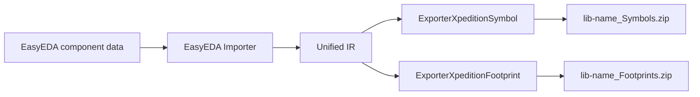

# Xpedition ASCII Library Export

This document describes the current Xpedition ASCII library export implemented through the unified IR. It generates target text from EasyEDA data after IR normalization; it does not read Xpedition libraries and does not claim complete compatibility without validation in the target software version.

## Current status

| Capability | Status | Notes |
| --- | --- | --- |
| Symbol export | Implemented | Generates Xpedition ASCII symbol text for pins, electrical types, rectangles, polylines, polygons, circles, and three-point arcs |
| Footprint export | Implemented | Generates Padstack and Cell HKP text for outlines, graphics, text, regions, and standalone holes |
| Multi-part symbols | Implemented | Writes one symbol entry per part |
| ZIP packaging | Implemented | Produces separate uncompressed ZIP packages for symbols and footprints |
| 3D model association | Not implemented | No Xpedition 3D association is written; CLI and GUI report and skip the option |
| Target-software validation | Not complete | Automated tests cover text structure, ZIP integrity, and the project export pipeline |

## Data flow

The exporter does not re-parse EasyEDA JSON. Coordinates, pin semantics, pad types, and footprint primitives are normalized by the IR builder first, then converted to Xpedition units and syntax.

## Units and coordinates

- IR geometry uses millimeters.
- Xpedition text currently uses thousandth-inch (TH) units.
- Lengths are converted with `mm / 0.0254`.
- The footprint Cell origin is the center of the current geometry bounds, with Y inverted for output.
- Symbol coordinates preserve the IR orientation and are converted to TH values.

## Output files

When symbols and footprints are exported together, the output contains:

- `<lib-name>_Symbols.zip`: ASCII symbol entries named `<symbol-name>.<part-number>`.
- `<lib-name>_Footprints.zip`: `<name>_Pads.hkp` and `<name>_Cell.hkp` for each footprint.

The two stages cannot share one `.zip` path because they run concurrently and would conflict during commit. The exporters therefore return `_Symbols.zip` and `_Footprints.zip` suffixes respectively.

## Degradation and diagnostics

IR data that cannot be safely represented is not silently reported as exported:

- Footprint arcs are approximated as polylines with a maximum 15-degree step and produce an approximation diagnostic; text, filled regions, and standalone holes are written to the Cell.
- Text mirroring, text paths, and unknown layers produce diagnostics when the target cannot express them completely.
- 3D model references produce an unassociated-model diagnostic.
- Symbol ellipses, pies, elliptical arcs, paths, Bézier curves, IEEE graphics, ordinary text, text frames, and images still produce unsupported-element diagnostics.
- Duplicate footprint names receive numeric suffixes so ZIP entry names remain unique.
- Entry names are restricted to safe relative names; absolute paths, backslashes, and traversal segments are rejected.

## Verification scope

Automated verification currently includes:

- Dedicated Xpedition symbol and footprint unit tests.
- Through-hole Padstack hole-reference tests.
- Diagnostics tests for unsupported footprint primitives.
- All 43 CTest tests.
- A real 58-component export using the project BOM fixture and existing cache, with both packages validated by `unzip -t`.

Do not claim target-software compatibility until the generated libraries have been opened and saved in the intended Xpedition version.

## Code entry points

| Responsibility | File |
| --- | --- |
| ZIP writer | `src/core/xpedition/XpeditionZipWriter.*` |
| Symbol exporter | `src/core/xpedition/ExporterXpeditionSymbol.*` |
| Footprint exporter | `src/core/xpedition/ExporterXpeditionFootprint.*` |
| Exporter registration | `src/core/ExporterFactory.cpp` |
| Dedicated tests | `tests/unit/test_xpedition_exporter.cpp` |
