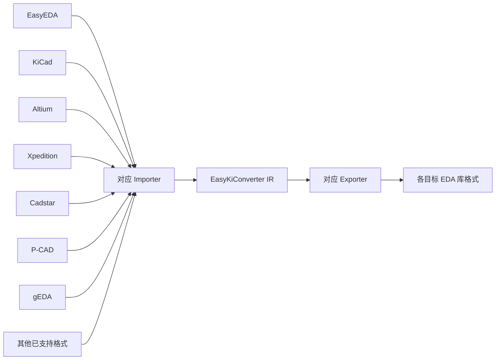
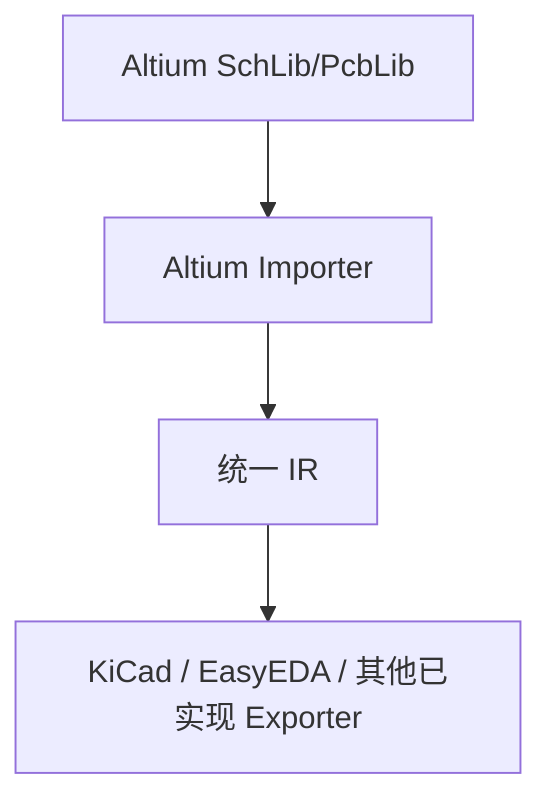
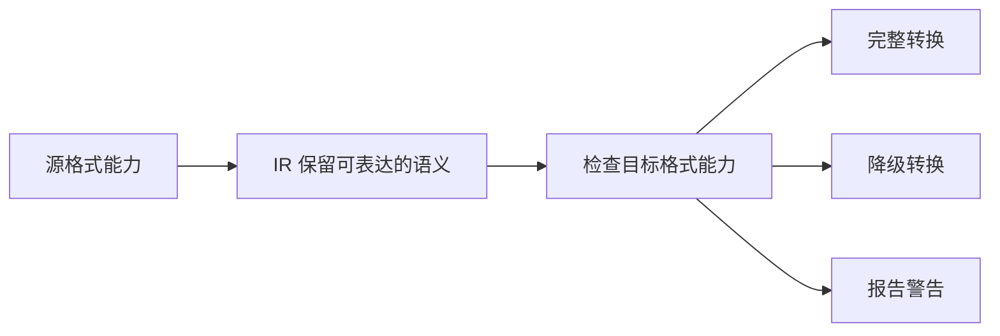

# 通用 EDA 库转换器规划

## 文档目的

本文档定义 EasyKiConverter 在 EDA 库转换方向上的长期目标、边界和演进路线。它是项目规划文档，不代表所有列出的格式已经实现。

## 1. 长期目标

EasyKiConverter 的长期目标是建立基于统一中间表示（Intermediate Representation，IR）的 EDA 库转换能力：


当某种格式同时具备 Importer 和 Exporter 后，它原则上可以与其他已接入格式互相转换。格式适配代码只负责处理本格式的语法和语义差异，不应为每一对格式编写专用转换器。

当前代码库已经具备 IR 目录和基础类型，包括 `SymbolComponentIR`、`FootprintComponentIR` 与 `Model3DIR`。相关设计和字段映射分别参见 [ADR 012：中间表示层架构重构](adr/012-intermediate-representation-refactor.md) 和 [转换层与映射关系](../developer/CONVERSION_MAPPING.md)。

## 2. 目标架构



例如，Altium 库转换应遵循以下数据流：



Importer 负责解析源文件并完成源格式到 IR 的语义映射；IR 负责表达与具体 EDA 无关的库数据；Exporter 负责生成目标格式并处理目标格式的能力差异。

## 3. 架构收益

统一 IR 可以避免转换路径随格式数量平方增长。假设支持 10 种 EDA：

- 两两实现有方向转换，最多需要 90 条转换路径；
- 采用统一 IR，只需实现 10 个 Importer 和 10 个 Exporter；
- 增加第 11 种格式时，主要工作是实现“新格式 → IR”和“IR → 新格式”。

这能降低重复逻辑、测试成本和长期维护成本，也使格式适配器不再依赖特定的数据来源。

## 4. 分阶段范围

### 4.1 第一阶段：EDA 库转换

优先完善库文件的通用转换能力，范围包括：

- Symbol；
- Footprint；
- 器件、符号与封装之间的关联关系；
- 3D Model；
- 常见属性和扩展元数据。

目标使用流程为：


该阶段的重点是完善 IR 的语义覆盖、格式适配器接口、目标能力检查以及转换结果报告。

### 4.2 第二阶段：EDA 项目转换

在库转换模型稳定后，再评估项目级数据的统一表示和转换。可能涉及：

- 原理图、PCB；
- 网络、器件实例；
- 导线、总线、图纸和层次结构；
- 板框、层叠、走线、过孔和覆铜区域；
- 设计规则及其他项目级数据。

项目转换涉及更多格式专有语义，不能简单视为库转换的自然延伸，应单独进行模型设计、兼容性评估和验收。

## 5. 转换质量边界

项目可以承诺：在源格式 Importer 和目标格式 Exporter 均已实现的前提下，提供转换路径；不应承诺所有格式之间都能实现 100% 无损转换。

不同 EDA 的数据模型并不完全一致，可能存在无法直接表达的内容，例如：

- 多单元符号、Alternate Body、De Morgan；
- 特殊引脚类型；
- 自定义 Pad Stack、阻焊定义；
- Shape、Region 和嵌入式模型；
- Variant；
- 器件与 Symbol/Footprint 的关联方式；
- 属性字段、字体和文本对齐方式。

处理原则如下：



如果目标格式无法表达某项数据，应尽量保留其语义或扩展属性，并明确报告降级和未映射内容；禁止静默丢弃重要数据。

## 6. 转换报告

建议提供 Conversion Report（转换报告）或 Compatibility Report（兼容性报告），使用户能够判断导出结果是否需要人工检查。

报告至少应记录：

- 成功、跳过和失败的对象数量；
- 降级转换及其原因；
- 未映射属性或元数据；
- 缺失或无法转换的 3D Model；
- 可定位到器件、图形或字段的警告。

示例：

```text
转换结果

Symbols:       125 / 125
Footprints:    123 / 125
3D Models:      98 / 125

警告：
U15：源格式 Pad Stack 使用了目标格式不支持的属性，已降级为普通通孔焊盘。
J3：自定义属性 XYZ 没有目标字段，已保存为扩展属性。
```

## 7. 格式支持边界和实现策略

项目目标应表述为：

> 支持尽可能多的主流 EDA 库格式，并对每种格式明确支持范围和限制。

不应承诺支持所有 EDA 产品、所有版本以及所有私有原生文件。格式支持难度和策略可大致划分为：

| 格式类型 | 实现难度 | 推荐策略 |
| --- | ---: | --- |
| XML、JSON、ASCII | 低 | 直接实现解析器和写入器 |
| 有公开规范的二进制格式 | 中 | 自行实现 Reader/Writer |
| 私有二进制格式 | 高 | 使用 SDK、官方工具或进行格式研究 |
| 加密或云端内部格式 | 很高或不可行 | 使用官方 API 或官方导出功能 |

优先直接解析可稳定读取的原生格式；如果原生格式不适合直接接入，则考虑支持该 EDA 官方提供的 ASCII、XML 或 Exchange 格式。依赖外部工具时，必须记录工具版本、运行平台和已知限制。

## 8. 项目产品定义

针对当前项目，推荐使用以下精确定义：

> 只要 EasyKiConverter 已支持某种 EDA 库格式作为输入，并且已实现目标格式的 Exporter，就可以将该库转换为目标 EDA 库格式。转换过程统一经过 EasyKiConverter IR；对于目标格式无法表达的源格式能力，系统进行兼容性检查，并在转换报告中说明完整转换、降级转换和未映射内容。

该定义符合当前的 Importer—IR—Exporter 架构，同时避免对“所有 EDA”或“100% 无损”作出无法验证的承诺。
