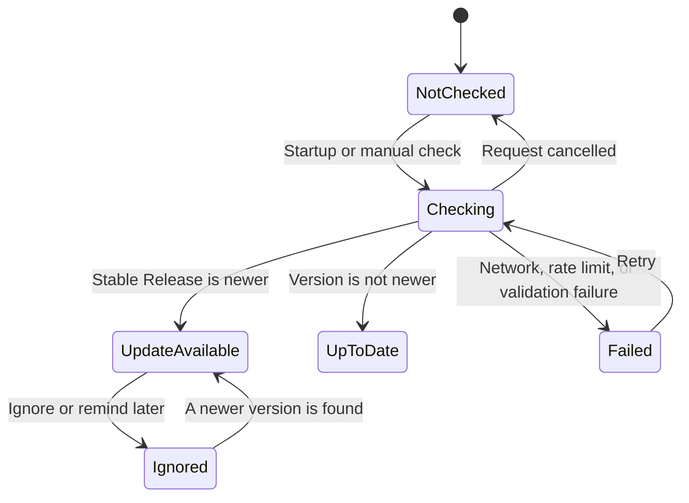

# Update Checking

## Current behavior

Two seconds after startup, the application checks for the latest GitHub stable Release only when startup checks are enabled. Startup checks are disabled by default and, when enabled, honor the 24-hour interval. The “Check for updates” action in the version dialog always performs a manual check and bypasses the interval. All requests use the project `NetworkClient` and `RequestProfiles::updateCheck()`.

## Local configuration and cache

Update checking reuses `ConfigService` and does not introduce a separate settings store. The persisted fields are:

- `updateAutoCheck`: whether startup checks are enabled; disabled by default.
- `updateCheckIntervalHours`: automatic check interval, 24 hours by default and limited to 1–168 hours.
- `updateLastCheckTime`: the most recent request start time.
- `updateLastSuccessfulCheckTime`: the most recent successfully validated Release time.
- `updateCachedRelease`: the most recent valid Release JSON.
- `updateIgnoredVersion`: the version explicitly ignored by the user.
- `updateRemindedVersion`: the version postponed by the user.

When the network fails, a valid local Release cache is applied first and the state is then reported as failed. This keeps cached update information available while the version dialog still reports the failed check. The failed state provides an "Open Release" action: it opens the cached Release page when available, otherwise it opens the official `releases/latest` page. Cache and ignore records are cleared when a newer version is found.

“Remind later” hides the current version and remains effective after restart. “Ignore this version” expresses a stronger preference and suppresses the current version until a newer version appears.

## Version and Release rules

Version comparison follows the basic SemVer rules and accepts `v3.1.13`, `3.1.13-beta.1`, `3.1.13-rc.1`, and versions with build metadata. Major, minor, and patch components are compared in order. A prerelease is lower than the stable version with the same base version; prerelease identifiers follow numeric and lexical ordering. Build metadata does not affect precedence. Invalid versions fail safely and never report a false update.

Only published stable Releases are accepted by default. Drafts, prereleases, and responses missing `tag_name`, `name`, a valid HTTPS `html_url`, or `assets` enter the failed state. When an update is available, the application always opens the Release page in the system browser so the user can choose the appropriate package.

## User interface

The update Banner shows checking, update available, and failed states. When an update is available, users can open the Release page, postpone the notification, or ignore the version. Failed checks provide a retry action. The version dialog opened from the title-bar version contains the current version, check status, startup auto-check switch, and manual check button.

## Limitations

GitHub ETag support is not implemented yet, and the application does not download or install updates automatically. The selected link is opened in the system browser; remote files are never executed directly.
