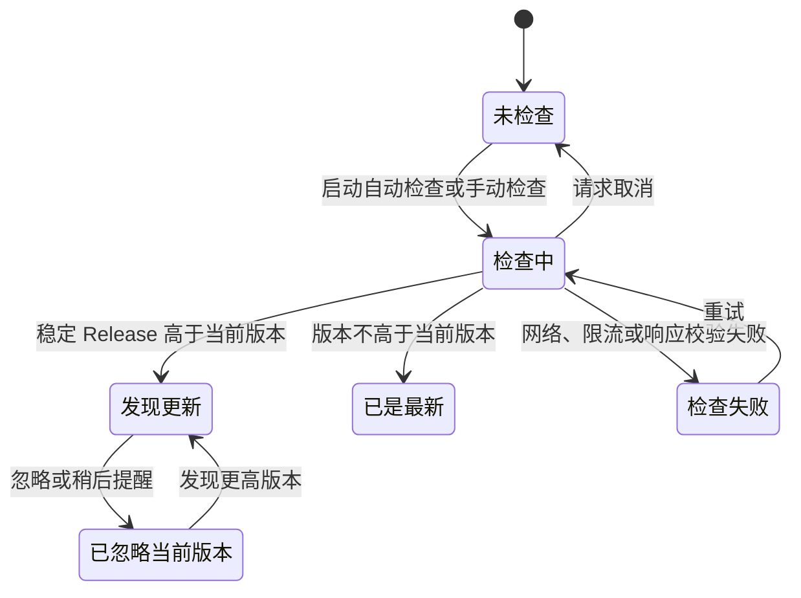

# 版本更新检查

## 当前行为

应用启动后会在延迟两秒时尝试检查 GitHub 的最新稳定 Release。自动检查受配置中的开关和检查间隔控制，默认间隔为 24 小时；设置页中的“检查更新”始终执行手动检查并绕过间隔限制。所有请求都通过项目的 `NetworkClient` 和 `RequestProfiles::updateCheck()` 发起。

## 本地配置和缓存

更新检查复用 `ConfigService`，不引入独立配置存储。保存字段包括：

- `updateAutoCheck`：是否启用启动时自动检查，默认启用。
- `updateCheckIntervalHours`：自动检查间隔，默认 24 小时，限制在 1 到 168 小时。
- `updateLastCheckTime`：最近一次发起请求的时间。
- `updateLastSuccessfulCheckTime`：最近一次成功校验 Release 的时间。
- `updateCachedRelease`：最近一次成功获取的 Release JSON。
- `updateIgnoredVersion`：用户明确忽略的版本。
- `updateRemindedVersion`：用户选择稍后提醒的版本。

网络失败时会先应用有效的本地 Release 缓存，再将状态标记为“检查失败”，因此用户可以继续看到已缓存的更新信息，同时设置页仍会显示本次检查失败。缓存和忽略记录在发现更高版本后自动清理。

“稍后提醒”只隐藏当前版本的提示，重启应用后仍然有效；“忽略此版本”表达更强的用户意图，当前版本不会再次提示，直到出现更高版本。

## 版本和 Release 规则

版本比较遵循 SemVer 基本规则，接受 `v3.1.13`、`3.1.13-beta.1`、`3.1.13-rc.1` 和带构建元数据的版本。主版本、次版本和补丁版本依次比较；预发布版本低于同一基础版本的稳定版本，预发布标识按数字和字符串标识比较；构建元数据不影响版本优先级。无法解析的版本安全失败，不会误报更新。

默认只接受已发布的稳定 Release。Draft、Pre-release、缺少 `tag_name`、`name`、合法 HTTPS `html_url` 或 `assets` 字段的响应会进入失败状态。更新链接优先选择当前平台和架构匹配的资产，找不到可靠匹配时回退到 Release 页面。

## 用户界面

更新 Banner 展示检查中、发现更新和检查失败状态。发现更新时可以查看平台资产或 Release 页面、稍后提醒、忽略当前版本；检查失败时提供重试。侧边栏的“版本更新”区域展示当前版本、检查状态、启动时自动检查开关和手动检查按钮。

## 限制

当前没有使用 GitHub ETag，也不执行自动下载安装。下载链接只交给系统默认浏览器打开，不会绕过安全校验直接执行远程文件。
